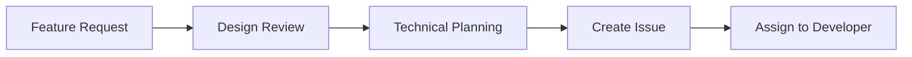
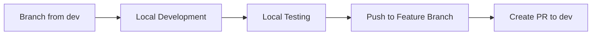
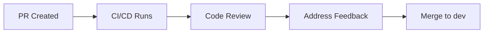
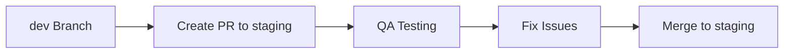
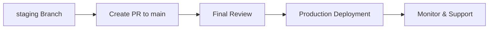

# 🚀 Team Workflow Guide - Rakshaayan Platform

## 📋 Table of Contents
- [Complete Development Lifecycle](#complete-development-lifecycle)
- [GitHub Actions Optimization](#github-actions-optimization)
- [Branch Strategy](#branch-strategy)
- [Team Collaboration Guidelines](#team-collaboration-guidelines)
- [CI/CD Best Practices](#cicd-best-practices)

---

## 🔄 Complete Development Lifecycle

### Phase 1: Design & Planning


**Steps:**
1. **Create Feature Request** (GitHub Issue)
   - Use template: `.github/ISSUE_TEMPLATE/feature_request.md`
   - Tag with appropriate labels: `enhancement`, `frontend`, `backend`, `ai`, etc.
   - Assign to team member

2. **Design Review**
   - Create design mockups (Figma/Canva)
   - Review with team lead
   - Update issue with design links

3. **Technical Planning**
   - Break down into tasks
   - Estimate effort
   - Identify affected services
   - Plan database changes

### Phase 2: Development


**Steps:**
1. **Setup Local Environment**
   ```bash
   # Clone repository
   git clone https://github.com/rakshaayanplatform/mvpi-regulatory-platform.git
   cd mvpi-regulatory-platform
   
   # Setup environment
   cp .env.example .env
   # Copy env files for all services
   cp services/*/env.example services/*/.env
   
   # Start services
   docker-compose -f infrastructure/docker-compose.yml up -d
   ```

2. **Create Feature Branch**
   ```bash
   git checkout dev
   git pull origin dev
   git checkout -b feature/your-feature-name
   ```

3. **Development Workflow**
   - Code your feature
   - Write tests
   - Test locally
   - Commit frequently with clear messages

4. **Push and Create PR**
   ```bash
   git push origin feature/your-feature-name
   # Create PR to dev branch on GitHub
   ```

### Phase 3: Code Review & Testing


**Steps:**
1. **CI/CD Pipeline** (Automated)
   - Tests run on all services
   - Security scans
   - Code quality checks
   - Docker builds

2. **Code Review**
   - Team lead reviews code
   - Address feedback
   - Update PR if needed

3. **Merge to dev**
   - Only merge when all checks pass
   - Use squash merge for clean history

### Phase 4: Staging & QA


**Steps:**
1. **Create PR: dev → staging**
   - Automated deployment to staging environment
   - QA team tests features
   - Report bugs/issues

2. **Address QA Feedback**
   - Create new feature branches for fixes
   - Follow same workflow
   - Re-test in staging

### Phase 5: Production Deployment


**Steps:**
1. **Create PR: staging → main**
   - Final code review
   - Security review
   - Performance review

2. **Production Deployment**
   - Automated deployment to production
   - Database migrations
   - Health checks

3. **Post-Deployment**
   - Monitor application health
   - User feedback collection
   - Bug fixes if needed

---

## ⚡ GitHub Actions Optimization (Free Tier)

### Current Limits
- **2,000 minutes/month** for free tier
- **Concurrent jobs**: 20 (shared across all repos)

### Optimization Strategies

#### 1. **Conditional Job Execution**
```yaml
# Only run tests for changed services
jobs:
  test-frontend:
    if: contains(github.event.head_commit.modified, 'frontend/')
    runs-on: ubuntu-latest
    steps:
      - uses: actions/checkout@v4
      - name: Test Frontend
        run: cd frontend && npm test

  test-backend:
    if: contains(github.event.head_commit.modified, 'services/')
    runs-on: ubuntu-latest
    steps:
      - uses: actions/checkout@v4
      - name: Test Backend
        run: |
          cd services/auth_service && python -m pytest
          cd services/patient_service && python -m pytest
```

#### 2. **Parallel Job Execution**
```yaml
jobs:
  test-services:
    strategy:
      matrix:
        service: [auth, patient, hospital, manufacturer, gov, coordinator, media]
    runs-on: ubuntu-latest
    steps:
      - uses: actions/checkout@v4
      - name: Test ${{ matrix.service }}
        run: cd services/${{ matrix.service }}_service && python -m pytest
```

#### 3. **Caching Dependencies**
```yaml
- name: Cache Python dependencies
  uses: actions/cache@v3
  with:
    path: ~/.cache/pip
    key: ${{ runner.os }}-pip-${{ hashFiles('**/requirements.txt') }}
    restore-keys: |
      ${{ runner.os }}-pip-

- name: Cache Node modules
  uses: actions/cache@v3
  with:
    path: frontend/node_modules
    key: ${{ runner.os }}-node-${{ hashFiles('frontend/package-lock.json') }}
    restore-keys: |
      ${{ runner.os }}-node-
```

#### 4. **Skip Unnecessary Jobs**
```yaml
# Skip deploy jobs on PRs
deploy-staging:
  if: github.ref == 'refs/heads/staging' && github.event_name == 'push'
  runs-on: ubuntu-latest
  steps:
    - name: Deploy to staging
      run: echo "Deploy to staging"

# Skip security scans on documentation changes
security-scan:
  if: |
    github.event_name == 'pull_request' &&
    !contains(github.event.pull_request.title, '[skip security]') &&
    !contains(github.event.pull_request.title, '[docs]')
```

#### 5. **Optimized Workflow Structure**
```yaml
name: Optimized CI/CD

on:
  push:
    branches: [dev, staging, main]
  pull_request:
    branches: [dev, staging, main]

jobs:
  # Quick checks first (fail fast)
  lint:
    runs-on: ubuntu-latest
    steps:
      - uses: actions/checkout@v4
      - name: Lint code
        run: |
          cd frontend && npm run lint
          cd services/auth_service && flake8 .

  # Tests only for changed services
  test-changed:
    runs-on: ubuntu-latest
    steps:
      - uses: actions/checkout@v4
      - name: Get changed files
        id: changed-files
        uses: tj-actions/changed-files@v39
        with:
          files: |
            frontend/**
            services/**
      
      - name: Test frontend
        if: steps.changed-files.outputs.any_changed == 'true' && contains(steps.changed-files.outputs.all_changed_files, 'frontend/')
        run: cd frontend && npm test
      
      - name: Test backend
        if: steps.changed-files.outputs.any_changed == 'true' && contains(steps.changed-files.outputs.all_changed_files, 'services/')
        run: |
          for service in services/*; do
            if [ -f "$service/requirements.txt" ]; then
              cd "$service" && python -m pytest
            fi
          done

  # Build only when needed
  build:
    needs: [lint, test-changed]
    if: github.ref == 'refs/heads/staging' || github.ref == 'refs/heads/main'
    runs-on: ubuntu-latest
    steps:
      - uses: actions/checkout@v4
      - name: Build Docker images
        run: |
          docker build -t frontend ./frontend
          docker build -t auth-service ./services/auth_service
          # ... other services
```

---

## 🌿 Branch Strategy

### Branch Hierarchy
```
main (production)
├── staging (QA/testing)
    ├── dev (development)
        ├── feature/patient-dashboard
        ├── feature/hospital-workflow
        └── feature/ai-integration
```

### Branch Protection Rules

#### Main Branch
- ✅ Require pull request reviews
- ✅ Require status checks to pass
- ✅ Require branches to be up to date
- ✅ Include administrators
- ✅ Restrict pushes

#### Staging Branch
- ✅ Require pull request reviews
- ✅ Require status checks to pass
- ✅ Require branches to be up to date
- ✅ Include administrators
- ✅ Restrict pushes

#### Dev Branch
- ✅ Require status checks to pass
- ✅ Require branches to be up to date
- ❌ Allow force pushes (for emergency fixes)

### Required Status Checks
- `lint` - Code linting
- `test-changed` - Tests for changed services
- `build` - Docker builds (only on staging/main)

---

## 👥 Team Collaboration Guidelines

### 1. **Daily Standup**
- **Time**: 9:00 AM IST
- **Duration**: 15 minutes
- **Format**: What did you do yesterday? What will you do today? Any blockers?

### 2. **Code Review Standards**
- **Reviewer**: At least one team lead
- **Timeline**: Within 24 hours
- **Checklist**:
  - [ ] Code follows project standards
  - [ ] Tests are included
  - [ ] Documentation is updated
  - [ ] No security vulnerabilities
  - [ ] Performance impact considered

### 3. **Communication Channels**
- **GitHub Issues**: Feature requests, bugs
- **GitHub Discussions**: General questions, ideas
- **Pull Request Comments**: Code-specific feedback
- **Slack/Discord**: Real-time communication

### 4. **File Naming Conventions**
```
Feature branches: feature/descriptive-name
Bug fixes: fix/issue-description
Hotfixes: hotfix/critical-fix
Documentation: docs/update-readme
```

### 5. **Commit Message Standards**
```
feat: add patient dashboard
fix: resolve authentication issue
docs: update API documentation
test: add unit tests for auth service
refactor: improve error handling
```

---

## 🚀 CI/CD Best Practices

### 1. **Job Optimization**
- **Fail Fast**: Run quick checks first (lint, syntax)
- **Parallel Execution**: Run independent jobs in parallel
- **Conditional Jobs**: Only run jobs when relevant files change
- **Caching**: Cache dependencies to speed up builds

### 2. **Resource Management**
- **Job Timeout**: Set reasonable timeouts (10-15 minutes)
- **Resource Limits**: Use appropriate runner sizes
- **Cleanup**: Remove temporary files and containers

### 3. **Security**
- **Secrets Management**: Use GitHub Secrets for sensitive data
- **Dependency Scanning**: Regular security scans
- **Code Quality**: Automated code quality checks

### 4. **Monitoring**
- **Job Success Rate**: Monitor CI/CD success rates
- **Build Times**: Track and optimize build times
- **Resource Usage**: Monitor GitHub Actions minutes usage

---

## 📊 Monthly Workflow Summary

### Week 1: Planning & Design
- Review feature requests
- Create design mockups
- Technical planning
- Assign tasks

### Week 2-3: Development
- Feature development
- Code reviews
- Testing
- Merge to dev

### Week 4: QA & Deployment
- Staging testing
- Bug fixes
- Production deployment
- Monitoring

### Monthly Review
- Performance metrics
- Process improvements
- Team feedback
- Tool optimization

---

## 🎯 Success Metrics

### Development Metrics
- **PR Review Time**: < 24 hours
- **Build Success Rate**: > 95%
- **Test Coverage**: > 80%
- **Bug Rate**: < 5% of features

### Process Metrics
- **Deployment Frequency**: Weekly releases
- **Lead Time**: < 1 week from PR to production
- **Recovery Time**: < 4 hours for critical issues

### Team Metrics
- **Code Review Participation**: 100% of PRs reviewed
- **Documentation Updates**: All features documented
- **Knowledge Sharing**: Regular team sessions

---

## 🆘 Troubleshooting

### Common Issues

#### 1. **CI/CD Timeout**
```bash
# Check job logs
# Optimize by:
# - Reducing test scope
# - Using caching
# - Parallel execution
```

#### 2. **Branch Protection Conflicts**
```bash
# Update local branch
git fetch origin
git rebase origin/main
# Resolve conflicts
git push --force-with-lease
```

#### 3. **Docker Build Failures**
```bash
# Check Dockerfile syntax
# Verify dependencies
# Test locally first
docker build -t test-image .
```

#### 4. **Test Failures**
```bash
# Run tests locally
cd frontend && npm test
cd services/auth_service && python -m pytest
# Check environment setup
```

---

## 📞 Support & Resources

### Team Contacts
- **Lead Developer**: vmtejus.sisail@gmail.com
- **QA Lead**: vaishalibhosle.sisail@gmail.com
- **DevOps**: mausam.sisial@gmail.com
- **Design**: swathiga.sisail@gmail.com

### Documentation
- **API Docs**: `/docs/api/`
- **Architecture**: `/docs/architecture/`
- **Deployment**: `/docs/deployment/`

### Tools & Services
- **GitHub**: Repository management
- **Docker**: Containerization
- **PostgreSQL**: Database
- **Tailscale**: Network connectivity

---

*Last updated: December 2024*
*Version: 1.0* 